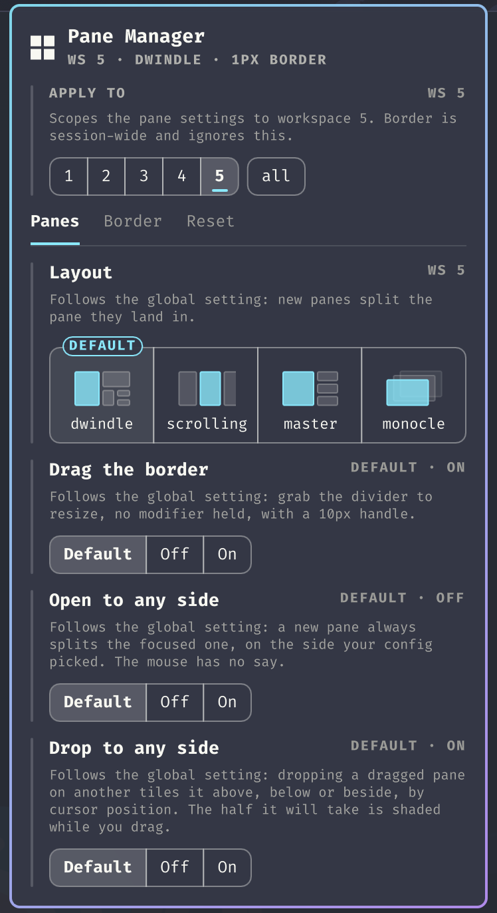

# Pane Manager

An [Omarchy](https://omarchy.org/) shell plugin for managing tiled panes from
the bar. Resize them by dragging the divider with your mouse, see where a
dragged pane will land before you drop it, set the border thickness and corner
style, and put a mangled layout back the way it was.



## Features

### Drag the divider to resize

Turns on `general:resize_on_border`, so the boundary between two panes is a
handle you can grab with the mouse — no modifier held, the way panes work in an
IDE. The grab area is configurable, and the cursor changes shape over it so the
affordance is discoverable.

### See where a dragged pane will land

`SUPER` + dragging a pane over another one tiles it above, below or beside the
target. Hyprland picks the side from your cursor but draws nothing to say which,
so the result is hard to predict. Pane Manager shades the half the pane is about
to take, live, while you drag.

### Border thickness and corners

Width in px and Square/Round corners, applied as you change them.

### Undo a mangled layout

Resizing a dwindle tree has no built-in undo. Two buttons restore the default
split ratios, for the current workspace or all of them, and reload your Hyprland
config on the way out — so they double as a way back from anything the panel
changed.

## Why

Hyprland already ships modifier-driven mouse resize, and Omarchy binds it out of
the box:

| Binding | Action |
|---|---|
| `SUPER` + drag left button | Move window |
| `SUPER` + drag right button | Resize window |

What it leaves off is `general:resize_on_border`, which lets you grab the
divider between two tiled panes directly, the way panes work in an IDE. This
plugin turns that on from the bar, puts the border chrome that goes with it in
the same place, and — because a resized dwindle tree has no built-in undo —
gives you a way to reset the split ratios.

Dropping a dragged pane has the same gap. Hyprland can tile it above, below or
beside the target depending on where your cursor is, but it draws nothing to say
which, so the result feels like a coin toss. This plugin shades the half the
pane is about to take, live, while you drag — see [Drop indicator](#drop-indicator).

## The panel

Left-clicking the bar icon opens it.

- **Drag the border** — `general:resize_on_border` on and off.
  Turning it **off hands everything back to the system**: the border thickness,
  corner radius and grab area all revert to whatever `~/.config/hypr/` says.
- **Drop to any side** — `dwindle:precise_mouse_move`. Off, a dropped pane only
  ever tiles left or right. On, it tiles above and below too, by cursor
  position, and the landing spot is shaded while you drag. Gates both halves at
  once: the overlay stays quiet whenever this is off.
- **Thickness** — border width in px (`general:border_size`)
- **Corners** — Square or Round (`decoration:rounding`). The shell mirrors this
  into its own chrome but only re-reads it at startup and on a theme change, so
  the plugin nudges `Style.scheduleRefresh()` after every change — otherwise the
  panel telling you "Square" would still be drawn with round corners itself.
- **Reset this workspace** / **Reset all workspaces** — restore default split
  ratios, then reload the config

Everything the panel changes is runtime-only, so the two resets and the off
switch are all reliable ways back to your configured state.

## Install

```bash
omarchy plugin add https://github.com/momoi-labs/omarchy-pane-manager.git --enable
```

To remove it:

```bash
omarchy plugin remove dev.momoi-labs.pane-manager
```

Removal takes the bar widget and the drop indicator with it and leaves nothing
behind: everything the plugin changes is set at runtime, so the next Hyprland
reload already has your own `~/.config/hypr/` values back. Anything you chose to
persist there (see below) is yours and stays until you remove it yourself.

### Requirements

Omarchy 4 (Quattro) or newer, plus two things an Omarchy install already has:

| Dependency | Used by |
|---|---|
| `jq` | `bin/pane-manager`, for reading Hyprland's JSON |
| `python3` | `bin/drop-indicator`, which talks to Hyprland's sockets directly |

No other external dependencies, and nothing is fetched at runtime.

## Persisting the settings

Both switches change Hyprland at runtime only — that is what makes the resets
and the off positions reliable ways back. To have them on at every login, and to
give the resets the state you actually want to land on, put it in
`~/.config/hypr/looknfeel.lua`:

```lua
hl.config({
  general = {
    resize_on_border = true,
    -- Pixels beyond the drawn border that still count as the handle. Larger is
    -- easier to grab; too large starts stealing clicks near a pane's edges.
    extend_border_grab_area = 10,
    -- Cursor changes shape over the handle, so the affordance is discoverable.
    hover_icon_on_border = true,
    -- Omarchy ships 2.
    border_size = 1,
  },

  decoration = {
    -- Omarchy ships 0, i.e. square.
    rounding = 8,
  },

  dwindle = {
    -- A dropped pane picks its side from the cursor, so it can land above and
    -- below as well as beside. The drop indicator stays dark while this is off.
    precise_mouse_move = true,
  },
})
```

## Settings

In `~/.config/omarchy/shell.json`:

```json
{ "id": "dev.momoi-labs.pane-manager", "grabArea": 10, "roundedRadius": 8, "maxBorderSize": 12 }
```

| Key | Default | What it does |
|---|---|---|
| `grabArea` | `10` | Grab area in px applied when the switch turns resizing on |
| `roundedRadius` | `8` | Corner radius applied by the Round option |
| `maxBorderSize` | `12` | Upper bound of the thickness field |

## CLI

The helper is usable on its own — handy for a keybinding:

```bash
BIN=~/.config/omarchy/plugins/dev.momoi-labs.pane-manager/bin/pane-manager
$BIN state                # JSON: enabled, grabArea, borderSize, rounding
$BIN enable [grabArea]
$BIN disable              # also reverts border chrome to your config
$BIN toggle [grabArea]
$BIN border <px>
$BIN corners <px>         # 0 = square
$BIN dropside <bool>
$BIN reset [--all]
```

## Drop indicator

With `dwindle:precise_mouse_move` on, dragging a pane and dropping it on another
tiles it above, below, or beside the target depending on where the cursor is —
but Hyprland draws nothing to say which. This plugin shades the half the pane is
about to occupy, live, while you drag.

Two things make that possible without a compositor plugin:

- **Drag detection with no polling.** Hyprland publishes no drag event, but
  dragging a *tiled* window flips it to floating for the duration of the drag
  (`DragController.cpp`, `changeFloatingMode` in `updateDragWindow`/`dragEnd`),
  and that flip is announced on socket2 as `changefloatingmode`. Drag start and
  end arrive as push events; the cursor is only polled in between. A manual
  float toggle is told apart from a drag by the fact that a drag first centres
  the window on the cursor.
- **The landing side is reproducible.** `DwindleAlgorithm.cpp` decides it from
  the cursor against the target box's centre, with the box's own diagonals as
  the threshold. `bin/drop-indicator` mirrors that, and the indicator paints the
  *result* — the half the new pane gets — rather than the triangles that pick it.

Because that rule is mirrored rather than queried, it is pinned to a Hyprland
version in the helper (`HYPRLAND_RULE_VERIFIED_ON`). If the compositor changes
how it decides, the indicator lies, which is worse than showing nothing — so it
is worth rechecking on major Hyprland updates.

The shaded rectangle takes its corner radius from `decoration:rounding`, so the
preview has the shape the pane will actually get rather than the shell theme's.

The overlay's input region is empty, so it can never swallow the drag it draws.

## What this plugin does not do

Moving panes with the mouse is already Hyprland's, and there is no
modifier-free version of it to add: a tiled pane has no titlebar to grab, so the
modifier is what tells the compositor you mean the window rather than its
contents. Omarchy binds it out of the box:

| Binding | Action |
|---|---|
| `SUPER` + drag left button | Move / swap the pane under the cursor |
| `SUPER` + `SHIFT` + arrows | Swap the focused pane in a direction |
| `SUPER` + `J` | Flip the split direction (the panel's button) |

## Notes for hackers

Omarchy 4 runs Hyprland's Lua config parser, which retires the legacy `hyprctl`
forms. Anything poking at Hyprland from a plugin needs the new spelling:

| Legacy | Omarchy 4 |
|---|---|
| `hyprctl keyword general:border_size 2` | `hyprctl eval 'hl.config({ general = { border_size = 2 } })'` |
| `hyprctl dispatch splitratio +0.1` | `hyprctl dispatch 'hl.dsp.layout("splitratio +0.1")'` (one string, not separate args) |
| — | `hyprctl dispatch 'hl.dsp.focus({ window = "address:0x…" })'` |

Boolean options come back as `.bool` in `hyprctl getoption -j`; `.int` is `null`
for them. The full Lua API is stubbed at `/usr/share/hypr/stubs/hl.meta.lua`.

Three more things worth knowing before you script against Hyprland:

- **`hyprctl` exits 0 when a dispatcher fails.** It prints `error: …` on stdout
  and returns success anyway, so a `set -e` script sails straight past a broken
  dispatch. Check the output.
- **`splitratio` takes a delta, and dwindle has no `exact`** (at least through
  0.56.2 — `splitratio exact 1` answers `failed to parse "exact" as a delta`).
  There is no "set this node to 1.0" message. Ratios clamp to `[0.1, 1.9]`
  though, so `splitratio -5` lands on a known 0.1 and `splitratio +0.9` reaches
  the default. That two-hop is how the reset here works.
- **`fc-query`'s charset can lie about Nerd Font glyphs.** It reported
  `U+F006E` (nf-md-backup_restore) as covered by JetBrainsMono Nerd Font; it
  renders as tofu. Screenshot your widget before trusting a glyph.

## License

MIT
