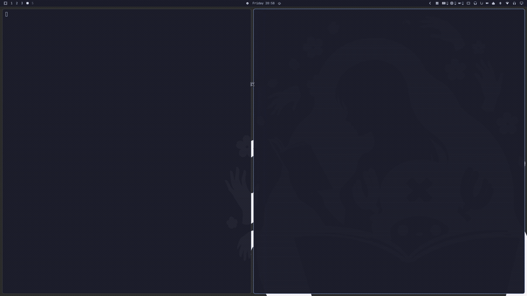
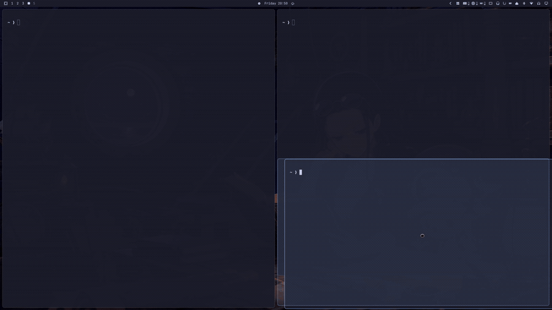

# Pane Manager

An [Omarchy](https://omarchy.org/) shell plugin for managing tiled panes from
the bar. Resize them by dragging the divider with your mouse, see where a
dragged pane will land before you drop it, set the border thickness and corner
style, and put a mangled layout back the way it was.


## Features

### Drag the divider to resize



Turns on `general:resize_on_border`, so the boundary between two panes is a
handle you can grab with the mouse — no modifier held, the way panes work in an
IDE. The grab area is configurable, and the cursor changes shape over it so the
affordance is discoverable.

### See where a dragged pane will land



`SUPER` + dragging a pane over another one tiles it above, below or beside the
target. Hyprland picks the side from your cursor but draws nothing to say which,
so the result is hard to predict. Pane Manager shades the half the pane is about
to take, live, while you drag.

### Switch to the scrolling layout

Hyprland ships a niri-like `scrolling` layout: new panes join a row that scrolls
sideways instead of splitting the pane they land in. The switch applies it to
every workspace; `bin/pane-manager layout scrolling --workspace` does just the
active one, for a keybinding.

Splitting is dwindle's, so on a scrolling workspace the panel turns off what
depends on it — the drop indicator and **Drop to any side**. **Drag the border**
is layout-agnostic and keeps working, and the two resets stay available: they
are the way back.

Hyprland tracks the layout per workspace, so the switch writes the same
per-workspace rules as Omarchy's own
`omarchy-hyprland-workspace-layout-toggle`, in
`~/.local/state/omarchy/workspace-layouts/<id>.lua`. The two agree, and the
choice survives a reload.

### Per workspace, or everywhere

The three behaviour switches — **Scrolling layout**, **Drag the border** and
**Drop to any side** — are answered per workspace on top of a global value, and
**Apply to** at the top of the panel says which of the two you are editing:

- `all` writes the global value: what every workspace falls back to. Setting it
  drops the workspaces' own answers, so what the panel shows is what you get
  everywhere.
- `ws <id>` writes an override for that workspace alone. The chips list the
  workspaces you have open, and a `·` marks the one you are on — you can set up
  ws 3 from ws 1.

That is what the third state on each switch is for. **Default** is not a value
but the absence of one: at workspace scope it hands the answer back to the
global setting — the badge says which, `DEFAULT · ON` — and at global scope it
hands it back to `~/.config/hypr/`. The scope always opens on the workspace you
are in, because a sticky `all` is how you change every workspace believing you
are changing one.

Only the layout is per workspace in Hyprland itself. `resize_on_border` and
`dwindle:precise_mouse_move` are single global options, so a per-workspace value
means "write this when the workspace takes focus" — the plugin does exactly
that, on every workspace change, without reloading anything. The border
thickness, corner radius and grab area are not scoped at all: they are chrome
rather than behaviour, and Hyprland has no per-workspace notion of them either.

The choices live in `~/.local/state/omarchy/pane-manager/`, as `global.json` and
`overrides.json`, next to a `config.json` snapshot of what `~/.config/hypr/`
asked for — `hyprctl getoption` answers with the value in force rather than the
configured one, and these are the options the plugin overwrites, so read live it
would drift into "whatever was applied last" and Default would stop meaning
anything. The snapshot is taken while the values are untouched, and again after
every reload. **Reset all workspaces** deletes the lot.

### Border thickness and corners

Width in px and Square/Round corners, applied as you change them.

### Undo a mangled layout

Resizing a dwindle tree has no built-in undo. Two buttons put things back, for
the current workspace or all of them: they drop any scrolling override, reload
your Hyprland config, and restore the default split ratios — so they double as a
way back from anything the panel changed.

## Why

Hyprland already ships modifier-driven mouse resize, and Omarchy binds it out of
the box:

| Binding | Action |
|---|---|
| `SUPER` + drag left button | Move window |
| `SUPER` + drag right button | Resize window |

What it leaves off is `general:resize_on_border`, which lets you grab the
divider between two tiled panes directly, the way panes work in an IDE. This
plugin turns that on from the bar, puts the border chrome that goes with it in
the same place, and — because a resized dwindle tree has no built-in undo —
gives you a way to reset the split ratios.

Dropping a dragged pane has the same gap. Hyprland can tile it above, below or
beside the target depending on where your cursor is, but it draws nothing to say
which, so the result feels like a coin toss. This plugin shades the half the
pane is about to take, live, while you drag — see [Drop indicator](#drop-indicator).

## The panel

Left-clicking the bar icon opens it. **Apply to** sits above three tabs —
**Panes**, **Border** and **Reset** — because it scopes the pane settings and
would be easy to set and forget inside one of them. The panel reopens on the tab
you left it on, until the shell restarts.

- **Apply to** — `ws <id>` or `all`: where the three switches in **Panes**
  write. See [Per workspace, or everywhere](#per-workspace-or-everywhere).

**Panes**

- **Scrolling layout** — `dwindle` (Off) or `scrolling` (On), written as
  workspace rules. On, what reads a split tree goes quiet: the drop indicator
  stops drawing and **Drop to any side** greys out and reads off, though the
  Hyprland option under it is untouched and comes back with dwindle.
- **Drag the border** — `general:resize_on_border` on and off, with the grab
  area from the settings. Off here means off, not "hand everything back": the
  two resets are what returns the border chrome to `~/.config/hypr/`.
- **Drop to any side** — `dwindle:precise_mouse_move`. Off, a dropped pane only
  ever tiles left or right. On, it tiles above and below too, by cursor
  position, and the landing spot is shaded while you drag. Gates both halves at
  once: the overlay stays quiet whenever this is off.

**Border**, session-wide: Hyprland keeps one border for every workspace, so
this tab ignores **Apply to**.

- **Thickness** — border width in px (`general:border_size`)
- **Corners** — Square or Round (`decoration:rounding`). The shell mirrors this
  into its own chrome but only re-reads it at startup and on a theme change, so
  the plugin nudges `Style.scheduleRefresh()` after every change — otherwise the
  panel telling you "Square" would still be drawn with round corners itself.

**Reset**

- **Reset this workspace** / **Reset all workspaces** — drop the overrides,
  reload the config, then restore the default split ratios. `--all` drops the
  global values too, so it is the way back to `~/.config/hypr/` in full. They
  stay enabled on a scrolling workspace, because they are the way off it.

The border chrome is runtime-only, and the resets clear the rest, so they remain
the reliable way back to your configured state.

## Install

```bash
omarchy plugin add https://github.com/momoi-labs/omarchy-pane-manager.git --enable
```

To remove it:

```bash
omarchy plugin remove dev.momoi-labs.pane-manager
```

Removal takes the bar widget and the drop indicator with it and leaves nothing
behind: everything the plugin changes is set at runtime, so the next Hyprland
reload already has your own `~/.config/hypr/` values back. Anything you chose to
persist there (see below) is yours and stays until you remove it yourself.

### Requirements

Omarchy 4 (Quattro) or newer, plus two things an Omarchy install already has:

| Dependency | Used by |
|---|---|
| `jq` | `bin/pane-manager`, for reading Hyprland's JSON |
| `python3` | `bin/drop-indicator`, which talks to Hyprland's sockets directly |

No other external dependencies, and nothing is fetched at runtime.

## Persisting the settings

The three behaviour switches are persisted in the plugin's own store, and the
layout also as workspace rules where Omarchy keeps them. The border thickness,
corner radius and grab area are runtime-only.

Your config is still what everything falls back to — it is what **Default** at
global scope, and both resets, land on. So it is worth putting the state you
want as a starting point in `~/.config/hypr/looknfeel.lua`:

```lua
hl.config({
  general = {
    resize_on_border = true,
    -- Pixels beyond the drawn border that still count as the handle. Larger is
    -- easier to grab; too large starts stealing clicks near a pane's edges.
    extend_border_grab_area = 10,
    -- Cursor changes shape over the handle, so the affordance is discoverable.
    hover_icon_on_border = true,
    -- Omarchy ships 2.
    border_size = 1,
  },

  decoration = {
    -- Omarchy ships 0, i.e. square.
    rounding = 8,
  },

  dwindle = {
    -- A dropped pane picks its side from the cursor, so it can land above and
    -- below as well as beside. The drop indicator stays dark while this is off.
    precise_mouse_move = true,
  },
})
```

## Settings

In `~/.config/omarchy/shell.json`:

```json
{ "id": "dev.momoi-labs.pane-manager", "grabArea": 10, "roundedRadius": 8, "maxBorderSize": 12 }
```

| Key | Default | What it does |
|---|---|---|
| `grabArea` | `10` | Grab area in px applied when the switch turns resizing on |
| `roundedRadius` | `8` | Corner radius applied by the Round option |
| `maxBorderSize` | `12` | Upper bound of the thickness field |

## CLI

The helper is usable on its own — handy for a keybinding:

```bash
BIN=~/.config/omarchy/plugins/dev.momoi-labs.pane-manager/bin/pane-manager
$BIN state                # JSON: what Hyprland reports now, plus the store
$BIN set <key> <value> [--workspace [id] | --all] [--grab <px>]
$BIN apply [--grab <px>]  # write what the active workspace asks for
$BIN border <px>          # global
$BIN corners <px>         # global; 0 = square
$BIN reset [--all]        # overrides, config, then split ratios
```

`set` takes `layout` (`dwindle`, `scrolling`, `default`), `drag` and `dropside`
(`on`, `off`, `default`), and defaults to `--all`. So a keybinding that flips
just the workspace you are on is:

```bash
$BIN set layout scrolling --workspace
```

`apply` is what the panel runs on every workspace change, to write the global
options that workspace asked for. You only need it by hand if you drive the
store from somewhere else.

These still work, for keybindings written against 1.0:

```bash
$BIN enable [grabArea]    # = set drag on --all
$BIN disable              # = clears drag, and reverts border chrome to config
$BIN toggle [grabArea]
$BIN dropside <bool>      # = set dropside on|off --all
$BIN layout <dwindle|scrolling> [--workspace | --all]
```

## Drop indicator

With `dwindle:precise_mouse_move` on, dragging a pane and dropping it on another
tiles it above, below, or beside the target depending on where the cursor is —
but Hyprland draws nothing to say which. This plugin shades the half the pane is
about to occupy, live, while you drag.

Two things make that possible without a compositor plugin:

- **Drag detection with no polling.** Hyprland publishes no drag event, but
  dragging a *tiled* window flips it to floating for the duration of the drag
  (`DragController.cpp`, `changeFloatingMode` in `updateDragWindow`/`dragEnd`),
  and that flip is announced on socket2 as `changefloatingmode`. Drag start and
  end arrive as push events; the cursor is only polled in between. A manual
  float toggle is told apart from a drag by the fact that a drag first centres
  the window on the cursor.
- **The landing side is reproducible.** `DwindleAlgorithm.cpp` decides it from
  the cursor against the target box's centre, with the box's own diagonals as
  the threshold. `bin/drop-indicator` mirrors that, and the indicator paints the
  *result* — the half the new pane gets — rather than the triangles that pick it.

Because that rule is mirrored rather than queried, it is pinned to a Hyprland
version in the helper (`HYPRLAND_RULE_VERIFIED_ON`). If the compositor changes
how it decides, the indicator lies, which is worse than showing nothing — so it
is worth rechecking on major Hyprland updates.

The shaded rectangle takes its corner radius from `decoration:rounding`, so the
preview has the shape the pane will actually get rather than the shell theme's.

The overlay's input region is empty, so it can never swallow the drag it draws.

## What this plugin does not do

Moving panes with the mouse is already Hyprland's, and there is no
modifier-free version of it to add: a tiled pane has no titlebar to grab, so the
modifier is what tells the compositor you mean the window rather than its
contents. Omarchy binds it out of the box:

| Binding | Action |
|---|---|
| `SUPER` + drag left button | Move / swap the pane under the cursor |
| `SUPER` + `SHIFT` + arrows | Swap the focused pane in a direction |
| `SUPER` + `J` | Flip the split direction (the panel's button) |

## Notes for hackers

Omarchy 4 runs Hyprland's Lua config parser, which retires the legacy `hyprctl`
forms. Anything poking at Hyprland from a plugin needs the new spelling:

| Legacy | Omarchy 4 |
|---|---|
| `hyprctl keyword general:border_size 2` | `hyprctl eval 'hl.config({ general = { border_size = 2 } })'` |
| `hyprctl dispatch splitratio +0.1` | `hyprctl dispatch 'hl.dsp.layout("splitratio +0.1")'` (one string, not separate args) |
| — | `hyprctl dispatch 'hl.dsp.focus({ window = "address:0x…" })'` |

Boolean options come back as `.bool` in `hyprctl getoption -j`; `.int` is `null`
for them. The full Lua API is stubbed at `/usr/share/hypr/stubs/hl.meta.lua`.

Three more things worth knowing before you script against Hyprland:

- **`hyprctl` exits 0 when a dispatcher fails.** It prints `error: …` on stdout
  and returns success anyway, so a `set -e` script sails straight past a broken
  dispatch. Check the output.
- **`splitratio` takes a delta, and dwindle has no `exact`** (at least through
  0.56.2 — `splitratio exact 1` answers `failed to parse "exact" as a delta`).
  There is no "set this node to 1.0" message. Ratios clamp to `[0.1, 1.9]`
  though, so `splitratio -5` lands on a known 0.1 and `splitratio +0.9` reaches
  the default. That two-hop is how the reset here works.
- **`fc-query`'s charset can lie about Nerd Font glyphs.** It reported
  `U+F006E` (nf-md-backup_restore) as covered by JetBrainsMono Nerd Font; it
  renders as tofu. Screenshot your widget before trusting a glyph.

## License

MIT
